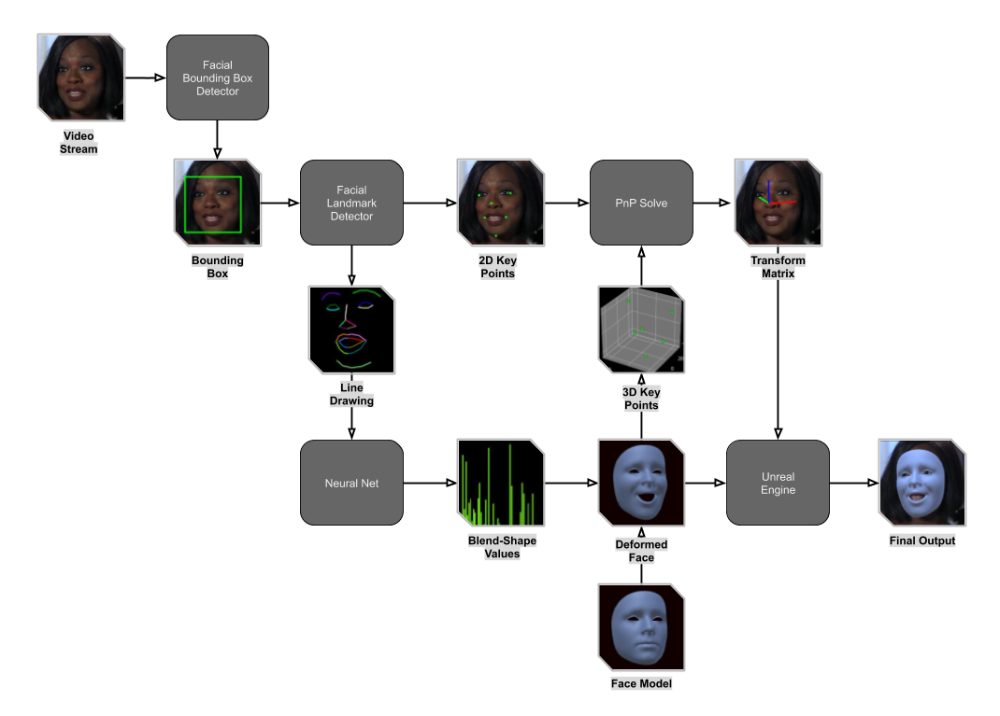

# Facial-Pose-Estimation-Libtorch-DLL

This repository is a CMAKE Project, it contains a `C++` implimentation of Realtime Facial and Headpose Estimation using `OpenCV` and a `CNN` trained in `Pytorch`.

## About
This is one of three repositories which together form a larger project, these are the three repositories:
- [facial-pose-estimation-pytorch-v2](https://github.com/NeuralVFX/facial-pose-estimation-pytorch-v2)
- [facial-pose-estimation-libtorch-dll](https://github.com/NeuralVFX/facial-pose-estimation-libtorch-dll) - You are here.
- [facial-pose-estimation-unreal](https://github.com/NeuralVFX/facial-pose-estimation-unreal)

This blog post describes the whole project: [AR Facial Pose Estimation](http://neuralvfx.com/augmented-reality/ar-facial-pose-estimation/)

## Extra Info
- The output of the CMAKE/Visual Studio Project is a `DLL` designed to work with my [unreal plugin](https://github.com/NeuralVFX/facial-pose-estimation-libtorch-unreal)
- The landmark detection network used is based on [HRNet](https://github.com/HRNet/HRNet-Facial-Landmark-Detection), yet modified to produce un-quantized results.
- The landmarks are converted into a line image using OpenCV, and then fed to my [pose estimation](https://github.com/NeuralVFX/facial-pose-estimation-pytorch-v2) model.
- Both of these models are traced via `JIT`, and executed using `LibTorch` in `C++`.
- The `DLL` outputs the `Transform Matrix`, a set of `Blendshape Values`, and the pixels of the image.

## Estimation Pipeline Diagram


## Requirements:
- CMake
- Visual Studio
- LibTorch 1.7
- PyTorch 1.7 (Required only to re-train or re-export Jit models)

## Project Setup
- Clone this repo: `git clone https://github.com/NeuralVFX/facial-pose-estimation-libtorch-dll.git`
- Open the `code` directory
- Open `pose_estimate.h` and replace the `".ptc"`, `".caffemodel"` and `"".prototxt` file paths to match the location you will place them on your system:
```
	/** File paths for models */
	const string face_detect_config_path = "C:/git-clone-tests/facial-pose-estimation-libtorch-dll/deploy.prototxt";
	const string face_detect_weight_path = "C:/git-clone-tests/facial-pose-estimation-libtorch-dll/res10_300x300_ssd_iter_140000_fp16.caffemodel";
	const string blend_shape_detect_mdl_path = "C:/git-clone-tests/facial-pose-estimation-libtorch-dll/bs_detect.ptc";
	const string landmark_detect_mdl_path = "C:/git-clone-tests/facial-pose-estimation-libtorch-dll/landmark_detect.ptc";
	const string blend_shape_mdl_path = "C:/git-clone-tests/facial-pose-estimation-libtorch-dll/bs_model.ptc";
```

- Open `build/CMakeLists.txt` and replace the directories `Torch_DIR`, `OpenCV_DIR`, `OpenCV_INC_DIR` and `OpenCV_LIB_DIR`
- Run these commands to build the project (replace `DCMAKE_PREFIX_PATH` with your `LibTorch` install directory):
```
cmake ./build -DCMAKE_PREFIX_PATH=C:\libtorch -DCMAKE_GENERATOR_PLATFORM=x64  ..
cmake --build . --config Release
```
- This should generate a Visual Studio Project and a file called `Release/facial-pose-estimation-libtorch.dll`
- Copy this file wherever you need!

